# AI Forecast — Intelligent AI/ML Forecasting Platform

[](https://fastapi.tiangolo.com)
[](https://python.org)
[](https://react.dev)
[](https://vitejs.dev)
[](https://tailwindcss.com)
[](https://scikit-learn.org)
[](LICENSE)

An end-to-end, full-stack Machine Learning time-series forecasting web application built for **BTech 5th-Semester Project Demonstration**, university viva defense, GitHub portfolio, and live cloud deployment.

🌐 **Live Production Frontend**: [https://ai-forecast-three.vercel.app](https://ai-forecast-three.vercel.app)  
📖 **Academic Viva Guide**: [VIVA_PREPARATION.md](VIVA_PREPARATION.md)

---

## 🎯 Key Capabilities

- **Zero Synthetic/Mock Data**: Real Scikit-learn models (`LinearRegression`, `RandomForestRegressor`), authentic Scikit-learn validation metrics ($\text{MAE}$, $\text{MSE}$, $\text{RMSE}$, $R^2$), and dynamic multi-step predictions.
- **Strict Chronological Splitting**: Prevents temporal look-ahead bias and data leakage (`shuffle=False`, 80% train, 20% validation).
- **Automated Feature Engineering**: Generates cyclic temporal transformations ($\sin/\cos$ calendar attributes), historical lag memory ($y_{t-1}, y_{t-7}$), and trailing 7-period moving averages.
- **Dynamic Recursive Multi-Step Forecasting**: At each future step $t$, previous predicted outputs are recursively fed back into lag and rolling features up to 90 days out-of-sample.
- **Empirical Prediction Intervals**: Computes realistic expanding confidence bounds ($80\%$, $95\%$, $99\%$ CI) derived from validation RMSE with compounding horizon variance.
- **Interactive Visualizations**: Interactive Recharts time-series charts, actual vs. predicted validation curves, and continuous historical-to-future projection timelines.
- **CSV Ingestion & Export**: Supports custom user CSV uploads and streaming downloads of future forecast schedules.

---

## 🏗️ System Architecture

```text
                               ┌─────────────────────────────────────────┐
                               │       React 18 + Vite SPA Frontend      │
                               │  (Tailwind CSS + Recharts + Lucide UI)  │
                               └────────────────────┬────────────────────┘
                                                    │ HTTP / JSON (Axios)
                                                    ▼
                               ┌─────────────────────────────────────────┐
                               │           FastAPI Backend API           │
                               │  (ASGI / Uvicorn / Pydantic Validation) │
                               └────────────────────┬────────────────────┘
                                                    │
        ┌───────────────────┬───────────────────────┼───────────────────────┬───────────────────┐
        ▼                   ▼                       ▼                       ▼                   ▼
┌───────────────┐   ┌───────────────┐       ┌───────────────┐       ┌───────────────┐   ┌───────────────┐
│ Dataset Svc   │   │ Preprocess Svc│       │ Training Svc  │       │Evaluation Svc │   │ Forecast Svc  │
│ (CSV Parsing, │   │ (Sorting,     │       │(Chronological │       │ (MAE, MSE,    │   │ (Recursive    │
│  Profiling)   │   │  Lags, MA)    │       │ Split, Fit)   │       │  RMSE, R²)    │   │  Feedback, CI)│
└───────────────┘   └───────────────┘       └───────┬───────┘       └───────────────┘   └───────────────┘
                                                    │
                                                    ▼
                                    ┌───────────────────────────────┐
                                    │ Model Serialization (Joblib)  │
                                    │  .joblib (Artifact) + .json   │
                                    └───────────────────────────────┘
```

---

## 🔄 Machine Learning Pipeline

```mermaid
flowchart LR
    A[Raw CSV Data] --> B[Datetime Validation & Chronological Sort]
    B --> C[Missing Value Imputation]
    C --> D[Feature Engineering: Lags & Calendar Signals]
    D --> E[Chronological Train / Validation Split 80/20]
    E --> F[Model Training: Linear Regression & Random Forest]
    F --> G[Validation Evaluation: MAE, RMSE, R² Leaderboard]
    G --> H[Recursive Multi-Step Forecasting + Prediction Intervals]
    H --> I[Interactive Chart & CSV Export]
```



---

## 📡 REST API Reference Table

| Method | Endpoint | Description |
| :--- | :--- | :--- |
| `GET` | `/health` | Server heartbeat and system status |
| `POST` | `/api/datasets/upload` | Upload and validate raw CSV (up to 10 MB) |
| `POST` | `/api/datasets/load-sample` | Ingest bundled 120-day sample sales dataset |
| `GET` | `/api/datasets` | List all uploaded and processed datasets |
| `POST` | `/api/preprocessing/run` | Execute chronological sort, imputation, and lag generation |
| `POST` | `/api/analytics/timeseries` | Compute descriptive statistics, quartiles, and moving averages |
| `GET` | `/api/models/available` | List supported architectures (Linear Regression, Random Forest) |
| `POST` | `/api/models/train` | Train model with strict chronological split (80/20) |
| `GET` | `/api/models` | List all serialized model artifacts |
| `GET` | `/api/evaluation/model/{id}`| Out-of-sample validation metrics (MAE, MSE, RMSE, R²) |
| `GET` | `/api/evaluation/compare` | Cross-model evaluation leaderboard and best performer |
| `POST` | `/api/forecast/generate` | Generate recursive multi-step future forecast with confidence intervals |
| `GET` | `/api/forecast/export` | Download forecasted values as a CSV file |

---

## 🚀 Local Quickstart Setup

### Prerequisites
- **Python 3.10+** (Tested on Python 3.14.0)
- **Node.js 18+** & **npm**
- **Git**

### 1. Backend Setup
```bash
cd backend

# Create virtual environment
python -m venv .venv

# Activate virtual environment
# On Windows PowerShell:
.\.venv\Scripts\Activate.ps1
# On macOS/Linux:
source .venv/bin/activate

# Install dependencies
pip install -r requirements.txt

# Run backend API server
python -m uvicorn app.main:app --host 127.0.0.1 --port 8000 --reload
```
- API Docs (Swagger): [http://127.0.0.1:8000/docs](http://127.0.0.1:8000/docs)
- Health Check: [http://127.0.0.1:8000/health](http://127.0.0.1:8000/health)

### 2. Frontend Setup
```bash
cd frontend

# Install dependencies
npm install

# Start Vite development server
npm run dev
```
- Web Application: [http://localhost:5173](http://localhost:5173)

### 3. Running Automated Tests
```bash
cd backend
.\.venv\Scripts\pytest
# All 26 unit tests across analytics, datasets, evaluation, forecasting, models, and preprocessing
```

---

## 📊 Milestone Progression

- [x] **Milestone 1**: Clean full-stack project foundation (FastAPI + React + Tailwind + CORS)
- [x] **Milestone 2**: Dataset ingestion, validation, column profiling, and sample dataset
- [x] **Milestone 3**: Chronological sorting, missing value imputation, and lag/cyclic feature engineering
- [x] **Milestone 4**: Interactive time-series charts, rolling averages, and statistical moments
- [x] **Milestone 5**: Model training pipeline with chronological split (Linear Regression & Random Forest)
- [x] **Milestone 6**: Model evaluation metrics (MAE, MSE, RMSE, R²), leaderboard, and actual vs predicted curves
- [x] **Milestone 7**: Recursive multi-step future forecasting, empirical confidence intervals, and CSV export
- [x] **Milestone 8**: Final project polish, comprehensive viva preparation guide, and in-app architecture hub

---

## 🎓 University Viva Presentation (5-Minute Walkthrough)
1. **Introduction**: Introduce the problem of temporal data leakage in classical academic ML projects.
2. **Datasets**: Load the 120-day daily sales sample dataset and show column profiles.
3. **Preprocessing**: Trigger chronological sorting and explain why `shuffle=False` is mandatory. Show generated `lag_1`, `lag_7`, and `rolling_mean_7` features.
4. **Analytics**: Show the rolling average trendline ($y = mx + c$) and kurtosis/skewness statistics.
5. **Training**: Train the Linear Regression baseline (~15ms) and Random Forest Regressor (~60ms).
6. **Evaluation**: Explain the difference between MAE and RMSE, and show why Random Forest was selected as best model based on validation RMSE.
7. **Forecasting**: Demonstrate multi-step recursive projection (14 days) and show how prediction intervals widen over time. Export the resulting CSV.
8. **Viva & Docs Tab**: Open the built-in Viva Defense Hub in the web app to review architectural diagrams and examiner Q&As!

---

## 📜 License
This project is open-source and licensed under the [MIT License](LICENSE).
